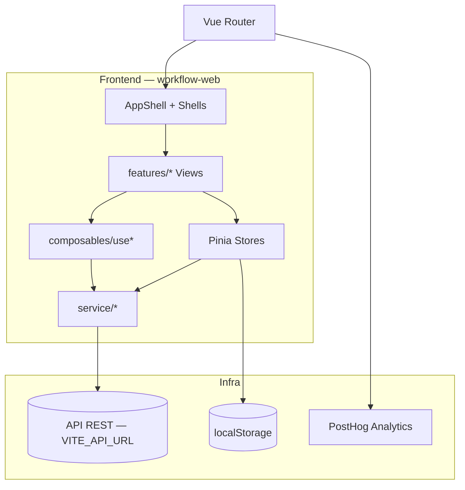

# Arquitetura

## Visão geral

O **work-flow** é uma SPA (Single Page Application) em Vue 3 que consome uma API REST externa. A aplicação é multi-empresa: o usuário autenticado pode pertencer a várias empresas e alterna o contexto ativo via header `x-company-id`.



## Stack

| Camada | Tecnologia |
|---|---|
| Framework | Vue 3.5 (Composition API + `<script setup>`) |
| UI | Vuetify 4.0 |
| Roteamento | Vue Router 5 |
| Estado global | Pinia 3 |
| Cache de dados | @tanstack/vue-query 5 |
| HTTP | Axios |
| Build | Vite 7 |
| Linguagem | TypeScript 5.9 |
| Ícones | lucide-vue-next (padrão) + @mdi/font (legado) |
| Tipografia | Inter Variable |
| Editor rich text | TipTap 3 |
| Gráficos | ECharts via vue-echarts |
| Motion | @vueuse/motion, motion-v |
| Toast | vue-sonner (via `useToast()`) |
| Analytics | PostHog |

## Estrutura de pastas

```
src/
├── App.vue                 # Root: v-app + AppShell + RouterView + Toast
├── main.ts                 # Bootstrap: Pinia, Router, Vuetify, Vue Query, tokens
├── router/index.ts         # Rotas e guards de autenticação
│
├── features/               # Módulos por domínio (1 view principal por feature)
│   ├── auth/
│   ├── board/
│   ├── bug-report/
│   ├── calendar/
│   ├── companies/
│   ├── dashboard/
│   ├── download/
│   ├── notes/
│   ├── repos/
│   ├── reports/
│   ├── settings/
│   ├── tasks/
│   └── tickets/
│
├── core/                   # Infraestrutura de layout e tipos compartilhados
│   ├── components/shells/  # AppShell, CommandShell, FocusShell, CanvasShell
│   └── types/
│
├── components/             # Componentes globais reutilizáveis
│   ├── ui/                 # Primitives (EmptyState, Skeleton, Pill, AuroraBackground)
│   ├── dashboard/
│   ├── modals/
│   ├── reports/
│   └── tasks/
│
├── composables/            # Lógica reativa reutilizável (useX.ts)
├── stores/                 # Pinia stores (auth, workspace, ui)
├── service/                # Clientes HTTP por domínio
├── plugins/                # Vuetify + tokens de design
└── styles/                 # reset.css, typography.css
```

## Padrões arquiteturais

### Organização por feature

Cada domínio vive em `features/<nome>/`:

- `<Nome>View.vue` — tela principal
- `components/` — sub-componentes exclusivos da feature
- `use*.ts` — composables locais (quando aplicável)
- `index.ts` — re-exports (opcional)

Componentes globais ficam em `components/`. O shell e layout em `core/components/shells/`.

### Fluxo de dados

1. **Preferências de UI** → `uiStores` via `useUiPreferences()` (persistido em `localStorage`)
2. **Auth e empresa ativa** → `authStores` + `workspaceStores` + `localStorage` (`token`, `activeCompany`)
3. **Dados remotos** → Vue Query nos composables (`useDashboardMetrics`, `useCompanyBoards`, etc.)
4. **Chamadas HTTP** → services em `service/` usando instância Axios central (`service/api.ts`)

### Autenticação

- Login grava `token` (JWT) em `localStorage`
- Interceptor Axios injeta `Authorization: Bearer <token>` e `x-company-id`
- Guard no router redireciona para `/login` se não houver token (exceto rotas públicas)
- Troca de empresa atualiza `activeCompany` e recarrega contexto (`workspaceStores.switchCompany` faz redirect para `/`)

### App Shell

`AppShell.vue` escolhe dinamicamente entre 3 variantes de layout (`command` | `focus` | `canvas`) com base em `ui.shell`. Rotas públicas/bare renderizam conteúdo sem shell.

Ver [design-system.md](./design-system.md) para detalhes dos shells.

### Boundaries

- Componentes shared dos shells **não** importam de `features/*`
- Features podem importar de `components/`, `composables/`, `stores/`, `service/`
- Cores: usar tokens CSS (`var(--text)`, `var(--surface)`) — nunca hex hard-coded em componentes novos

## Configuração Vue Query

Defaults em `main.ts`:

| Opção | Valor |
|---|---|
| `staleTime` | 2 minutos |
| `gcTime` | 10 minutos |
| `refetchOnWindowFocus` | false |

## Roles de empresa

Hierarquia usada para controle de acesso na UI:

| Role | Nível | Capacidades típicas na UI |
|---|---|---|
| VIEWER | 0 | Leitura limitada |
| CLIENT | 1 | Leitura |
| WORKER | 2 | CRUD de tarefas, variáveis |
| ADMIN | 3 | Gestão de usuários |
| OWNER | 4 | Controle total |

A role ativa vem da empresa selecionada (`workspaceStores.activeRole`).

## Views legadas / não roteadas

| Arquivo | Situação |
|---|---|
| `features/workspace/WorkspaceView.vue` | Implementada, mas **sem rota** — funcionalidade absorvida pelo Dashboard |
| `features/tickets/TicketsView.vue` | Implementada, referenciada na nav/Command Palette, mas **rota `/tickets` não registrada** no router |

## Scripts npm

| Comando | Descrição |
|---|---|
| `npm run dev` | Servidor de desenvolvimento Vite |
| `npm run build` | Type-check + build de produção |
| `npm run preview` | Preview do build |
| `npm run lint` | oxlint + eslint |
| `npm run format` | Prettier em `src/` |
