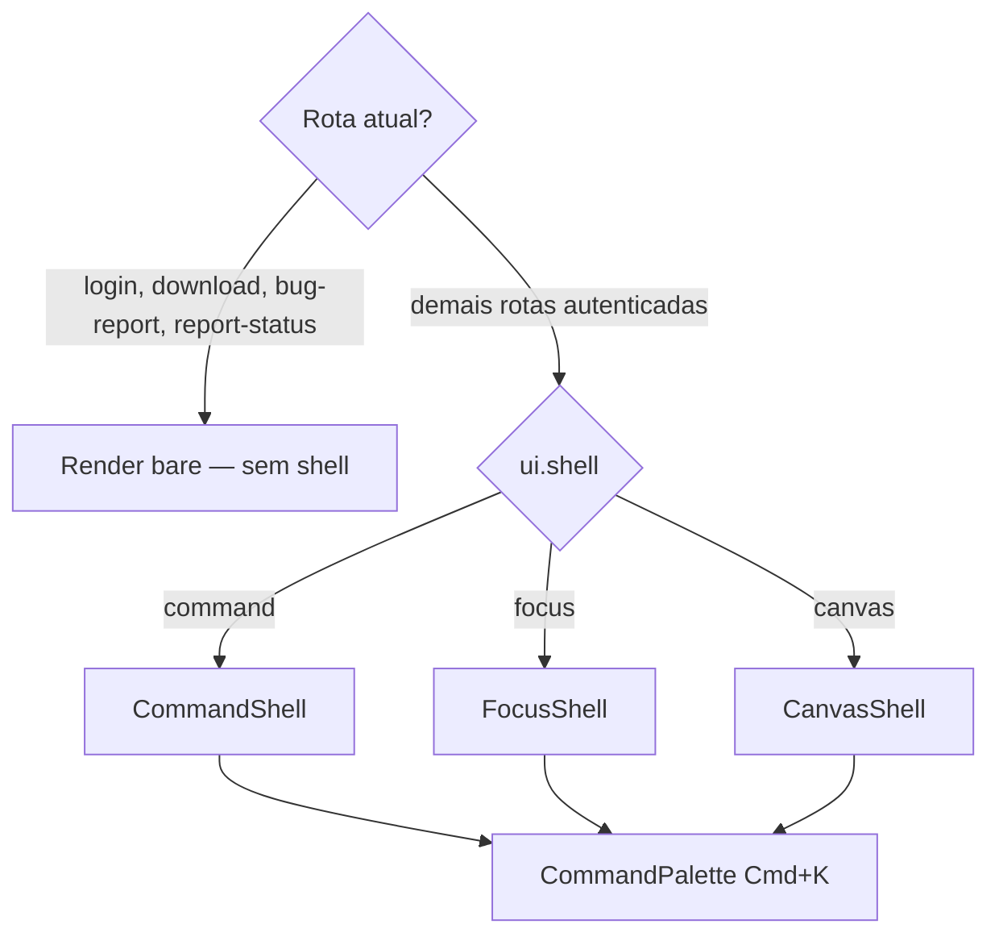

# Design System

Visão consolidada do sistema visual e de layout do work-flow. Para specs detalhadas de evolução, consulte [`specs/design-system-evolution.md`](./specs/design-system-evolution.md).

## Princípios

1. **Tokens first** — cores, radius, sombras e motion via CSS custom properties
2. **Sem hex em componentes** — adicionar token em `plugins/tokens.ts` se necessário
3. **lucide-vue-next** para ícones novos; `@mdi/font` apenas em código legado
4. **Inter Variable** como fonte principal
5. **Locale pt-BR** — copy fixo, sem i18n

## Tokens CSS

**Fonte única:** `src/plugins/tokens.ts` → aplicado em runtime via `applyThemeTokens(theme, accent)`.

### Backgrounds

| Token | Uso |
|---|---|
| `--bg` | Fundo da página |
| `--surface` | Cards, painéis |
| `--surface-2` | Hover, item ativo |
| `--surface-3` | Elevação extra |

### Texto

| Token | Opacidade |
|---|---|
| `--text` | 100% — primário |
| `--text-2` | 70% — secundário |
| `--text-3` | 48% — terciário |
| `--text-4` | 32% — eyebrow, hints |

### Status (Kanban)

| Token | Status |
|---|---|
| `--status-todo` | A fazer |
| `--status-prog` | Em andamento |
| `--status-test` | Em teste |
| `--status-done` | Concluído |
| `--status-block` | Bloqueado |

### Semânticos

| Token | Uso |
|---|---|
| `--success` | Sucesso |
| `--warn` | Aviso |
| `--err` | Erro |
| `--info` | Informação |

### Accent (trocável)

| Token | Descrição |
|---|---|
| `--accent` | Cor de destaque |
| `--accent-fg` | Texto sobre accent |

**Opções:** neutral, blue, violet, green, orange, pink

### Radius

| Token | Valor |
|---|---|
| `--radius-sm` | 6px |
| `--radius` | 10px |
| `--radius-lg` | 14px |
| `--radius-xl` | 20px |

### Motion

| Token | Valor |
|---|---|
| `--motion-fast` | 120ms |
| `--motion` | 180ms |
| `--motion-slow` | 280ms |
| `--motion-ease` | curva padrão |

## Tipografia

Classes utilitárias em `src/styles/typography.css`:

| Classe | Uso |
|---|---|
| `.text-display` | Títulos grandes |
| `.text-title` | Títulos de seção |
| `.text-subtitle` | Subtítulos |
| `.text-body` | Corpo |
| `.text-label` | Labels de formulário |
| `.text-meta` | Metadados, timestamps |
| `.text-eyebrow` | Seções uppercase |
| `.text-mono` | Código, IDs |

## Preferências do usuário

Persistidas em `localStorage` via `uiStores` / `useUiPreferences()`:

| Chave | Valores | Default |
|---|---|---|
| `ui.theme` | light, dark | dark |
| `ui.accent` | neutral, blue, violet, green, orange, pink | neutral |
| `ui.density` | compact, comfortable | compact |
| `ui.shell` | command, focus, canvas | command |

Configurável em `/settings`. Aplicado em runtime sem reload (exceto troca de empresa).

## App Shell

`AppShell.vue` seleciona a variante de layout:



### Command (default)

Topbar + sidebar clássica. Breadcrumbs na topbar. Navegação via `NavList.vue`.

### Focus

Rail 56px + coluna de contexto 240px. Inspirado em Linear. Quick actions na coluna lateral.

### Canvas

Nav horizontal + dock flutuante. Conteúdo full-bleed.

### Componentes shared

Em `core/components/shells/shared/`:

| Componente | Função |
|---|---|
| `CompanySwitcher` | Toggle de empresa (3 variantes) |
| `UserMenu` | Avatar + Settings / Logout |
| `CmdKButton` | Disparador da Command Palette |
| `ThemeToggle` | Sol/lua |
| `NavList` | Sidebar com quarters dinâmicos |

## UI Primitives

Em `components/ui/`:

| Componente | Props principais |
|---|---|
| `EmptyState` | icon, title, description + slot action |
| `Skeleton` | type: row, card, text, block |
| `Pill` | variant: soft, outline, solid |
| `AuroraBackground` | intensity: subtle, medium, bold |

## Classes utilitárias CSS

Em `styles/reset.css`:

| Classe | Efeito |
|---|---|
| `.glass` | Blur 14px + superfície semi-transparente |
| `.glass-strong` | Blur 20px, mais opaco |
| `.gradient-border` | Borda cônica animada (9s) |
| `.press` | Scale 0.97 no active |
| `.hover-lift` | translateY(-2px) + shadow no hover |

## Transições de rota

`AppShell.vue` usa `<Transition name="route">` com fade + translate + blur.

View Transitions API registrada via `::view-transition-*` no reset como fallback futuro.

## Integração Vuetify

`plugins/vuetify.ts` consome `vuetifyThemeColors` de `tokens.ts`:

- `primary` = background do surface elevado
- `secondary` = cor do texto principal

Componentes Vuetify herdam tokens via override em `App.vue`:

```css
.v-application { background: var(--bg); color: var(--text); }
```

## Feature de referência: Variáveis

Redesign completo (spec F3). Use como referência para novas features:

```
CompanyVariablesView
├── VariablesToolbar    — busca, filtro, sort, view toggle, export
├── VariablesList       — tabela densa (default)
├── VariablesGrid       — cards (alternativo)
├── VariableDrawer      — edição lateral 480px
├── VariableCreateDialog
├── VariableFieldInput  — TEXT/URL/SECRET com reveal
├── VariableTypeChip
└── useEnvExport        — gera .env
```

## Migração em andamento

| Item | Status |
|---|---|
| Tokens CSS | ✅ Entregue |
| 3 shells | ✅ Entregue |
| Variables redesign | ✅ Entregue |
| mdi → lucide | 🔄 ~171 ocorrências em 19 arquivos |
| Views legadas com hex hard-coded | 🔄 Ver [legacy-views-migration.md](./specs/legacy-views-migration.md) |

## Checklist para componentes novos

- [ ] Cores via `var(--token)`, nunca hex
- [ ] Ícones de `lucide-vue-next`
- [ ] Tipografia via classes utilitárias ou tokens
- [ ] Loading com `Skeleton.vue`
- [ ] Empty state com `EmptyState.vue`
- [ ] Feedback com `useToast()`
- [ ] Dados remotos via Vue Query quando aplicável
