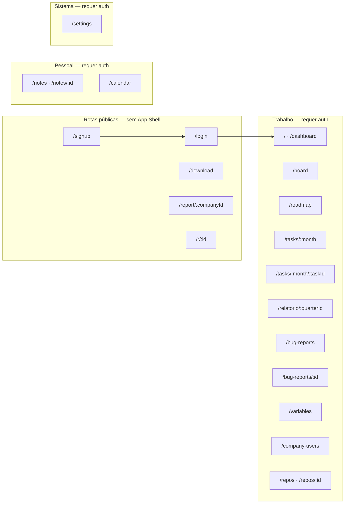

# Esquema de telas

Mapa completo de rotas, layouts, navegação e fluxos de usuário do work-flow.

## Diagrama de áreas



## Tabela de rotas

| Rota | Nome | View | Shell | Auth | Role |
|---|---|---|---|---|---|
| `/login` | login | `LoginView` | ❌ | Pública | — |
| `/signup` | signup | `SignupView` | ❌ | Pública | — |
| `/download` | download | `DownloadView` | ❌ | Pública | — |
| `/report/:companyId` | bug-report | `ReportBugView` | ❌ | Pública | — |
| `/reports/:companyId` | bug-report | *(alias)* | ❌ | Pública | — |
| `/r/:id` | report-status | `ReportStatusView` | ❌ | Pública | — |
| `/` | home | `DashboardView` | ✅ | JWT | — |
| `/dashboard` | dashboard | `DashboardView` | ✅ | JWT | — |
| `/board` | board | `BoardView` | ✅ | JWT | — |
| `/roadmap` | roadmap | `RoadmapView` | ✅ | JWT | — |
| `/tasks/:month` | tasks | `TasksView` | ✅ | JWT | — |
| `/tasks/:month/:taskId` | task-details | `TaskDetailsView` | ✅ | JWT | — |
| `/relatorio/:quarterId` | report | `ReportView` | ✅ | JWT | — |
| `/notes` | notes | `NotesView` | ✅ | JWT | — |
| `/notes/:id` | note-editor | `NoteEditorView` | ✅ | JWT | — |
| `/calendar` | calendar | `CalendarView` | ✅ | JWT | — |
| `/variables` | variables | `CompanyVariablesView` | ✅ | JWT | — |
| `/company-users` | company-users | `CompanyUsersView` | ✅ | JWT | ADMIN+ |
| `/settings` | settings | `SettingsView` | ✅ | JWT | — |
| `/bug-reports` | bug-reports-list | `BugReportsListView` | ✅ | JWT | — |
| `/bug-reports/:id` | bug-report-detail | `BugReportDetailView` | ✅ | JWT | — |
| `/repos` | repos-list | `ReposListView` | ✅ | JWT | — |
| `/repos/:id` | repo-browser | `RepoBrowserView` | ✅ | JWT | — |
| `/tickets` | — | `TicketsView` | — | — | **Rota não registrada** |

## Navegação principal

A sidebar (`NavList.vue`) organiza itens em duas seções:

### Trabalho

| Item | Rota | Observação |
|---|---|---|
| Dashboard | `/dashboard` | Home alternativa |
| Board | `/board` | Kanban cross-company |
| Roadmap | `/roadmap` | Timeline mockada de eventos e atividades |
| Bug reports | `/bug-reports` | Lista interna |
| Tarefas | dinâmico | Submenu por trimestre → mês |
| ↳ Relatório Q* | `/relatorio/:quarterId` | Editor TipTap por trimestre |
| ↳ Mês | `/tasks/:monthId` | Board + backlog do mês |
| Variáveis | `/variables` | Credenciais por empresa |
| Usuários | `/company-users` | Visível só para ADMIN+ |

### Pessoal

| Item | Rota |
|---|---|
| Notas | `/notes` |
| Calendário | `/calendar` |

### Itens fora da sidebar

| Item | Rota | Acesso |
|---|---|---|
| Repositórios | `/repos` | URL direta ou Command Palette |
| Configurações | `/settings` | UserMenu ou Cmd+K |
| Tickets | `/tickets` | Shells + Cmd+K (rota pendente) |

## Detalhamento por tela

### Autenticação

#### Login (`/login`)
- Formulário e-mail + senha
- Grava JWT em `localStorage.token`
- Redirect para `/` após sucesso
- Link para signup e download do app desktop

#### Signup (`/signup`)
- Criação de conta via `POST /user`
- Redirect para login após sucesso

#### Download (`/download`)
- Página de download do app desktop (GitHub Actions artifact)
- Sem autenticação

---

### Dashboard (`/` e `/dashboard`)

Visão geral da empresa ou do workspace completo.

**Modos:**
- **Empresa** — métricas, backlog, gráficos da empresa ativa
- **Workspace** — visão agregada de todas as empresas do usuário

**Blocos principais:**
- Cards de métricas (total, concluídas, em progresso, atrasadas)
- Gráfico de tendência semanal (criadas vs concluídas)
- Backlog resumido
- Próximos eventos
- Atalhos para criar tarefa / trocar empresa

**Dados:** Vue Query (`useDashboardMetrics`, `useBacklog`, `useWorkspaceDashboard`, `useUpcomingEvents`)

---

### Board (`/board`)

Kanban **cross-company** com todas as atividades do workspace.

**Colunas:** TODO → IN_PROGRESS → IN_TESTING → DONE

**Filtros:** busca textual, empresa, prioridade (P0–P3)

**Interações:** drag-and-drop entre colunas, click abre detalhe da tarefa

---

### Roadmap (`/roadmap`)

Timeline anual de eventos, atividades e marcos por área, inspirada em roadmap trimestral.

**Estado atual:** dados mockados no frontend até o backend expor rotas próprias.

**Blocos principais:**
- Trilhas por área (Planejamento, Estratégia, Desenvolvimento, Business Intelligence)
- Q1–Q4 no topo, com reviews trimestrais
- Barras de atividades por período, progresso e status
- Marcos pontuais com data e label

---

### Tarefas (`/tasks/:month`)

Gestão de atividades de um **mês específico** dentro de um trimestre.

**Abas:**
- **Board** — Kanban do mês (4 colunas de status)
- **Backlog** — itens não alocados ao mês

**Ações:**
- Criar atividade (modal `TaskForm`)
- Drag-and-drop com update otimista
- Filtro por responsável (role WORKER vê só suas tarefas)

**Navegação hierárquica:** Trimestre (Q1–Q4) → Mês → Tarefa

---

### Detalhe da tarefa (`/tasks/:month/:taskId`)

Tela focada em uma atividade individual.

**Funcionalidades:**
- Edição inline de título, descrição, status, prioridade, prazo
- Subtarefas (criar, editar, concluir)
- Anexos
- Histórico de status
- Sugestão com IA (`POST /activity/:id/suggest`)
- Comentários / atividade

---

### Relatório trimestral (`/relatorio/:quarterId`)

Editor rich text (TipTap) para documentar entregas do trimestre.

**Ações:**
- Salvar relatório (`POST /quarter/:id/report`)
- Melhorar com IA (`POST /quarter/:id/report/improve`)

---

### Variáveis (`/variables`)

Gestão de variáveis de ambiente por empresa (`CompanyVariable`).

**Views:** lista densa (default) ou grid de cards

**Funcionalidades:**
- CRUD de variáveis com campos tipados (TEXT, URL, SECRET)
- Drawer lateral de edição (480px) com abas Campos / Histórico
- Export `.env` (copy ou download)
- Upload de imagem por variável
- Busca, filtro por tipo, ordenação

**Atalhos:** `/` (busca), `N` (nova), `Esc` (fecha drawer)

---

### Usuários (`/company-users`)

Gestão de empresas e membros. Requer role ADMIN ou superior.

**Abas:**
- **Usuário** — empresas do usuário logado, adicionar membros
- **Sistema** — todas as empresas (visão admin), criar empresa/usuário

**Modais:** AddUser, BulkAddUsers, CreateCompany, CreateUser

---

### Notas (`/notes`)

Lista de notas com pastas e busca.

**Ações:** criar nota (`/notes/new`), filtrar por pasta, buscar

---

### Editor de nota (`/notes/:id`)

Editor TipTap completo com toolbar rica.

**Extensões:** headings, listas, task lists, tabelas, code blocks com syntax highlight, imagens, links, cores, alinhamento

**Rota especial:** `/notes/new` cria nota nova

---

### Calendário (`/calendar`)

Calendário mensal com eventos.

**Tipos de evento:** MEETING, DEADLINE, REMINDER, SPRINT, RETROSPECTIVE, TASK, PERSONAL

**Integrações:**
- CRUD de eventos locais
- Vincular Google Calendar (`GET /auth/google/link`)

**Modal:** `EventModal` para criar/editar eventos

---

### Bug reports — público

#### Envio (`/report/:companyId`)
- Formulário público (sem login)
- Upload de vídeo (mp4/webm/mov/mkv, max 18MB) ou gravação (max 60s)
- Campos: nome, contato, título, descrição
- Retorna ID para acompanhamento

#### Status (`/r/:id`)
- Acompanhamento público do processamento
- Status: RECEIVED → PROCESSING → READY / FAILED

---

### Bug reports — interno

#### Lista (`/bug-reports`)
- Todos os reports da empresa ativa
- Filtros por status
- Link público copiável para clientes

#### Detalhe (`/bug-reports/:id`)
- Mensagens, transcrição, metadados do vídeo
- Thread de comunicação

---

### Repositórios

#### Lista (`/repos`)
- Repositórios agrupados por owner GitHub ou empresa
- Busca por nome
- **Oculto da sidebar** — acesso via URL

#### Browser (`/repos/:id`)
- Navegação em árvore de arquivos
- Visualização de código com highlight.js
- Branches, pull requests, clone URL
- Controle de acesso por repositório

---

### Configurações (`/settings`)

Painel de preferências e integrações.

| Seção | Conteúdo |
|---|---|
| Aparência | Tema (claro/escuro), acento (6 opções), densidade |
| Shell | Variante Command / Focus / Canvas (preview wireframe) |
| Importação | Upload XML do Jira (drag-and-drop) |
| Notificações | Webhook Discord por empresa |
| Repositórios | Seção comentada (feature oculta) |

---

### Tickets (`/tickets`) — pendente

View implementada (`TicketsView.vue`) com CRUD de tickets internos, mas **a rota não está registrada** no router. Referenciada nos shells e Command Palette.

---

## Command Palette (Cmd+K)

Overlay global disponível em todas as telas com shell.

**Seções:**
- Navegação rápida (Dashboard, Tickets, Variáveis, Usuários, Settings)
- Troca de tema
- Troca de empresa
- Empresas recentes
- Logout

## Fluxos principais

### Onboarding
```
/signup → /login → (JWT) → / (Dashboard)
```

### Ciclo de tarefa
```
Nav: Tarefas → Q* → Mês → /tasks/:month
  → criar/editar no board ou backlog
  → /tasks/:month/:taskId (detalhe + subtarefas + IA)
```

### Bug report externo
```
Cliente: /report/:companyId → upload vídeo → /r/:id (status)
Equipe:  /bug-reports → /bug-reports/:id (triagem)
```

### Troca de empresa
```
CompanySwitcher → localStorage.activeCompany → reload contexto → /
```

## Hierarquia temporal

O produto organiza trabalho em **trimestres (Q1–Q4)**, cada um com **meses**. A navegação de tarefas reflete essa hierarquia:

```
Empresa
└── Trimestre (ex: Q1 2026)
    ├── Relatório → /relatorio/:quarterId
    └── Mês (ex: Janeiro)
        └── Tarefas → /tasks/:monthId
            └── Atividade → /tasks/:monthId/:taskId
```

Os trimestres são carregados dinamicamente da API (`useNavQuarters`) e injetados na sidebar.

## Guards e redirecionamentos

| Condição | Comportamento |
|---|---|
| Sem token em rota protegida | Redirect → `/login` |
| Token presente em `/login` | Redirect → `/` |
| `meta.requiredRole: ADMIN` em `/company-users` | Verificação adicional na view |
| Troca de empresa | `window.location.href = '/'` (reload completo) |
