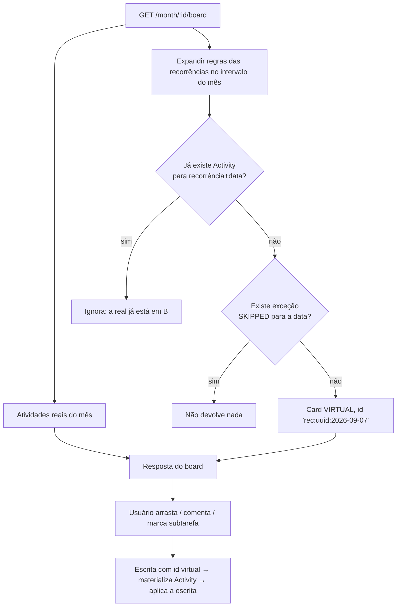

# Contrato do backend — Tarefas recorrentes

**Status:** protótipo de frontend pronto (`/recorrentes`, dado fictício) · backend a fazer
**Criada:** 03/09/2026
**Protótipo:** [`src/features/tasks/recurring/`](../../src/features/tasks/recurring/)
**Motor de datas de referência:** [`recurrence-engine.ts`](../../src/features/tasks/recurring/recurrence-engine.ts)

---

## 1. O problema que isto resolve

Três coisas que hoje são trabalho manual repetido todo mês no board de `/tasks/:month`:

1. **As tarefas fixas do mês.** Existe um conjunto de atividades que precisam ser
   feitas todo mês ("fechamento financeiro", "conferir backup"). Elas ficam
   paradas numa coluna do quadro o mês inteiro e, na virada, alguém **recopia
   cada uma à mão** para o mês seguinte.
2. **Tarefa que já nasce em andamento.** `POST /activity` cria sempre em `TODO`.
   Quando a atividade já está em andamento no momento em que é escrita, é
   preciso criar e depois arrastar — duas ações para uma decisão só.
3. **Mudar o mês exige recriar.** O mês da atividade é escolhido à parte do
   prazo (`monthId` no corpo do POST). Mudar só a data não muda o mês, então
   "adiar para novembro" vira "criar de novo em novembro".

Além disso, o que não existe hoje: **repetição por dia da semana**. Uma reunião
de segunda ou um relatório de terça e quinta viram quatro ou cinco cards
duplicados criados na mão.

## 2. Os três conceitos

| Conceito | O que é | Onde vive |
|---|---|---|
| **Recorrência** (`ActivityRecurrence`) | O texto da tarefa + a regra de repetição. É o que a pessoa cria e edita. | Tabela nova |
| **Ocorrência** | A tarefa de UM dia específico. `2026-09-07` da recorrência "reunião de segunda". | **Derivada da regra** — só vira linha quando alguém mexe nela (§3) |
| **Exceção** (`ActivityRecurrenceException`) | Uma data dispensada ou remarcada, sem virar tarefa. "Nesta segunda tem feriado." | Tabela nova, pequena |

A recorrência **não é um tipo diferente de tarefa**. Ela carrega os mesmos
campos de uma atividade comum (título, descrição, prioridade, responsáveis,
tags, subtarefas) e mais a regra. Uma atividade avulsa é uma recorrência com
`frequency = 'ONCE'` — no frontend é o mesmo formulário, e trocar uma na outra é
trocar um campo.

## 3. A decisão central: ocorrência derivada, materializada sob demanda

Esta é a decisão que estrutura todo o resto, e vale gastar dois minutos nela.

### As três opções consideradas

| | Como | Custo |
|---|---|---|
| **A. Tudo virtual** | O board calcula as ocorrências na hora e nunca grava nada. | Ocorrência não pode receber comentário, anexo, tempo, subtarefa marcada nem ordem manual — não existe linha para apontar. Inviável: o board atual depende de `Activity` real para tudo isso. |
| **B. Tudo materializado** | Um cron gera as atividades com N meses de antecedência. | Regra sem fim precisa de horizonte arbitrário; editar a regra não conserta o que já foi gerado; apagar a recorrência deixa órfãos; a base cresce com atividades que ninguém abriu. É o problema atual automatizado, não resolvido. |
| **C. Virtual até o primeiro toque** ✅ | A leitura calcula; a **primeira escrita materializa** a ocorrência daquele dia numa `Activity` real. | Uma indireção a mais na escrita (§7.3). Em troca: sem cron, sem horizonte, sem órfão, e regra editada vale imediatamente para tudo que ninguém tocou. |

**Recomendação: C.** É o que o protótipo do frontend já modela (`overrides` em
[`useRecurringTasks.ts`](../../src/features/tasks/recurring/useRecurringTasks.ts)),
e é o que permite "toda segunda, para sempre" existir sem materializar o
calendário inteiro por antecedência — que é exatamente o trabalho manual de
virada de mês que a feature existe para matar.

### O fluxo



## 4. Modelo de dados

Prisma, seguindo o estilo do schema atual.

```prisma
enum RecurrenceFrequency {
  ONCE
  DAILY
  WEEKLY
  MONTHLY
}

model ActivityRecurrence {
  id        String   @id @default(uuid())
  companyId String

  // ── Conteúdo da tarefa (espelha Activity) ──
  title          String
  description    String?  @db.Text
  priorityNumber Int      @default(1)

  /// Status em que CADA ocorrência nasce. Não é `TODO` fixo: as fixas do mês
  /// nascem em `IN_TESTING` e é isso que dispensa arrastar toda vez.
  initialStatus  ActivityStatus @default(TODO)

  // ── Regra ──
  frequency  RecurrenceFrequency

  /// A cada N dias/semanas/meses. Sempre >= 1. Ignorado em ONCE.
  interval   Int      @default(1)

  /// Dias da semana em WEEKLY. 0 = domingo … 6 = sábado. Vazio nas demais.
  weekdays   Int[]    @default([])

  /// Dia do mês em MONTHLY: 1..31. Ignorado nas demais. Ver `monthDayLast`.
  monthDay   Int?

  /// `true` = "último dia do mês", qualquer que seja (28/29/30/31).
  /// Campo separado em vez de sentinela mágica no `monthDay`.
  monthDayLast Boolean @default(false)

  /// DAILY que pula sábado e domingo. Ignorado nas demais.
  skipWeekends Boolean @default(false)

  /// Primeira data possível. DATE puro, sem hora. Em ONCE, é o prazo.
  startDate  DateTime @db.Date

  /// Última data possível. `null` = sem fim (o caso das fixas do mês).
  endDate    DateTime? @db.Date

  /// Pausada: para de gerar ocorrência NOVA. As já materializadas continuam.
  active     Boolean  @default(true)

  createdById String
  createdAt   DateTime @default(now())
  updatedAt   DateTime @updatedAt

  company     Company  @relation(fields: [companyId], references: [id], onDelete: Cascade)
  responsibles ActivityRecurrenceResponsible[]
  tags         ActivityRecurrenceTag[]
  subtasks     ActivityRecurrenceSubtask[]
  exceptions   ActivityRecurrenceException[]
  activities   Activity[]

  @@index([companyId, active])
}

/// Data que foge da regra SEM virar tarefa.
///
/// Dispensar uma segunda de feriado não deveria criar uma Activity só para
/// marcá-la como cancelada. Remarcar sozinho também não: enquanto ninguém
/// abriu a tarefa, ela ainda é uma linha de calendário.
model ActivityRecurrenceException {
  id           String   @id @default(uuid())
  recurrenceId String

  /// A data ORIGINAL gerada pela regra. É a chave de identidade da ocorrência.
  occurrenceDate DateTime @db.Date

  /// SKIPPED = não aparece. RESCHEDULED = aparece em `newDate`.
  kind         RecurrenceExceptionKind
  newDate      DateTime? @db.Date

  createdAt    DateTime @default(now())

  recurrence   ActivityRecurrence @relation(fields: [recurrenceId], references: [id], onDelete: Cascade)

  @@unique([recurrenceId, occurrenceDate])
}

enum RecurrenceExceptionKind {
  SKIPPED
  RESCHEDULED
}
```

E dois campos na `Activity` existente:

```prisma
model Activity {
  // ... campos atuais ...

  /// De qual recorrência esta atividade nasceu. `null` = tarefa comum.
  recurrenceId   String?

  /// Qual data da regra ela materializa. A dupla com `recurrenceId` é ÚNICA:
  /// é o que impede dois clientes arrastando o mesmo card virtual criarem
  /// duas atividades para a mesma segunda-feira.
  occurrenceDate DateTime? @db.Date

  recurrence     ActivityRecurrence? @relation(fields: [recurrenceId], references: [id], onDelete: SetNull)

  @@unique([recurrenceId, occurrenceDate])
}
```

**`onDelete: SetNull` é deliberado.** Apagar a recorrência não pode apagar
atividade que já teve trabalho registrado em cima (tempo, comentário, anexo).
Ela vira uma tarefa comum e fica no histórico.

As tabelas `ActivityRecurrenceResponsible` / `...Tag` / `...Subtask` são pivots
iguais às da `Activity`; a subtarefa aqui é só `{ title, description, position }`
(é o roteiro do modelo — o progresso é de cada dia, não do modelo).

## 5. Algoritmo de expansão

`expandRule(rule, from, to) → Date[]`, tudo em **data pura, sem hora, em UTC**
(§9). Ordem crescente, sem repetição. É o que o frontend já implementa em
[`recurrence-engine.ts`](../../src/features/tasks/recurring/recurrence-engine.ts);
as duas implementações precisam concordar, e §6 tem os vetores para provar isso.

```
floor = max(rule.startDate, from)
ceil  = min(rule.endDate ?? to, to)
se floor > ceil: []

ONCE:
  [rule.startDate] se estiver dentro de [from, to], senão []

DAILY:
  passo = max(1, interval)
  anda de `passo` em `passo` A PARTIR DE startDate (não de `floor`)
  descarta sábado e domingo se skipWeekends
  para quando passar de `ceil`

WEEKLY:
  dias = weekdays (ou [weekday(startDate)] se vazio)
  âncora = domingo da semana que contém startDate
  para cada data em [floor, ceil]:
    entra se weekday(data) ∈ dias
       E  floor((data - âncora) / 7) % interval == 0
       E  data >= startDate

MONTHLY:
  para cada mês em [mês(floor), mês(ceil)]:
    distância = meses entre mês(startDate) e o mês corrente
    entra se distância >= 0 E distância % interval == 0
    dia = monthDayLast ? último dia do mês : min(monthDay, último dia do mês)
```

Quatro regras que não são óbvias e que já custaram bug no protótipo:

1. **A cadência de `DAILY` conta a partir de `startDate`, não da janela pedida.**
   Se contar do início do mês consultado, "a cada 3 dias" muda de régua conforme
   o mês que o usuário abriu, e a mesma regra devolve datas diferentes para
   janelas diferentes.
2. **`WEEKLY` com `interval > 1` conta SEMANAS inteiras**, ancoradas no domingo
   da semana de `startDate` — não dias corridos. Sem a âncora, "a cada 2 semanas
   na sexta" desalinha quando a consulta começa no meio de uma semana.
3. **`MONTHLY` com `monthDay = 31` recorta para o último dia do mês** (fevereiro
   vira 28/29). Recortar, e não pular: a tarefa fixa não pode sumir em fevereiro.
   Por isso `monthDayLast` existe — quem quer "sempre no fim" declara isso, em
   vez de escrever 31 e torcer.
4. **Teto de segurança.** O protótipo corta em 400 ocorrências por expansão.
   `DAILY interval=1` num intervalo largo precisa de um limite, senão uma
   consulta boba vira varredura.

## 6. Vetores de teste (copiar como teste unitário)

Estes casos passam no motor do frontend. Se passarem no backend também, as duas
implementações concordam — e concordar importa: o card virtual é desenhado pelo
front com os dados que o back mandou, mas a data em si é calculada nos dois
lados em telas diferentes.

| Regra | Janela | Resultado esperado |
|---|---|---|
| `WEEKLY`, weekdays `[1,3]`, start `2026-09-01` | 01→30/09/2026 | `02, 07, 09, 14, 16, 21, 23, 28, 30` de setembro |
| `WEEKLY`, weekdays `[5]`, interval `2`, start `2026-09-01` | 01/09→15/10/2026 | `2026-09-04, 2026-09-18, 2026-10-02` |
| `MONTHLY`, `monthDayLast`, start `2026-09-01` | 01/12/2026→31/03/2027 | `2026-12-31, 2027-01-31, 2027-02-28, 2027-03-31` |
| `MONTHLY`, `monthDay 31`, start `2027-01-01` | 01/01→31/03/2027 | `2027-01-31, 2027-02-28, 2027-03-31` |
| `DAILY`, `skipWeekends`, start `2026-09-05` (sábado) | 05→13/09/2026 | `07, 08, 09, 10, 11` de setembro |
| `DAILY`, interval `3`, start `2026-09-01` | 10→20/09/2026 | `10, 13, 16, 19` de setembro |
| `ONCE`, start `2026-10-05` | 01→30/09/2026 | vazio |
| `WEEKLY`, weekdays `[1]`, start `2026-09-01`, end `2026-09-15` | 01→30/09/2026 | `2026-09-07, 2026-09-14` |
| `WEEKLY`, weekdays `[1]`, start `2026-09-15` | 01→30/09/2026 | `2026-09-21, 2026-09-28` (nada antes do início) |

Referência de calendário: **01/09/2026 é uma terça-feira**; 2028 é bissexto
(fevereiro com 29).

## 7. Endpoints

### 7.1 CRUD da recorrência

```
GET    /company/:companyId/activity-recurrence
POST   /company/:companyId/activity-recurrence
GET    /activity-recurrence/:id
PATCH  /activity-recurrence/:id
DELETE /activity-recurrence/:id
```

`POST` / `PATCH` — corpo:

```json
{
  "title": "Fechamento financeiro do mês",
  "description": "<p>Conferir notas, conciliar entradas...</p>",
  "priorityNumber": 0,
  "initialStatus": "IN_TESTING",
  "rule": {
    "frequency": "MONTHLY",
    "interval": 1,
    "weekdays": [],
    "monthDay": null,
    "monthDayLast": true,
    "skipWeekends": false,
    "startDate": "2026-09-01",
    "endDate": null
  },
  "active": true,
  "responsibleUserIds": ["uuid-user-1"],
  "tagIds": ["uuid-tag-1", "uuid-tag-2"],
  "subtasks": [
    { "title": "Conferir notas emitidas", "description": "" }
  ]
}
```

Convenções, iguais às de `PATCH /activity/:id` para não haver duas gramáticas:
campo **ausente** não é tocado; `tagIds` e `responsibleUserIds` são o conjunto
**completo** (`[]` desvincula tudo); `endDate: null` limpa a data.

Resposta do `GET` da lista: os campos acima mais

```json
{
  "id": "uuid",
  "createdAt": "2026-09-01T12:00:00.000Z",
  "nextOccurrences": ["2026-09-30", "2026-10-31", "2027-01-31"],
  "_count": { "materialized": 2, "exceptions": 1 }
}
```

`nextOccurrences` (3 datas a partir de hoje) evita o front recalcular a regra só
para mostrar a prévia do card, **e** serve de conferência cruzada: divergência
entre a prévia do servidor e a do motor local é sinal de que os dois algoritmos
saíram de sincronia.

**`DELETE`** apaga a recorrência e suas exceções. As `Activity` materializadas
**ficam** (viram tarefa comum, `recurrenceId → null`), porque podem ter tempo e
comentário em cima. A resposta diz quantas sobreviveram:
`{ "deleted": true, "keptActivities": 2 }`.

### 7.2 O board com os cards virtuais

`GET /month/:monthId/board` (endpoint que já existe) passa a devolver, além das
colunas atuais, os cards virtuais das recorrências da empresa que caem dentro do
intervalo de datas daquele mês.

O card virtual entra **na mesma coluna** que o `initialStatus` da recorrência
manda, com esta forma:

```json
{
  "id": "rec:9f2c…:2026-09-07",
  "isVirtual": true,
  "recurrenceId": "9f2c…",
  "occurrenceDate": "2026-09-07",
  "title": "Reunião de alinhamento semanal",
  "priorityNumber": 1,
  "dueDate": "2026-09-07T12:00:00.000Z",
  "status": "TODO",
  "position": null,
  "responsibles": [{ "userId": "…", "user": { "id": "…", "name": "Ana Prado" } }],
  "tags": [{ "tag": { "id": "…", "name": "Rotina", "slug": "rotina", "color": "blue" } }],
  "subtasks": [],
  "_count": { "docs": 0, "attachments": 0 }
}
```

Quatro regras do card virtual:

- **`id` com prefixo `rec:`** e o formato `rec:<recurrenceId>:<YYYY-MM-DD>`. O
  prefixo existe para ser impossível confundir com um uuid de atividade — e é
  ele que as rotas de escrita reconhecem (§7.3).
- **`position: null`.** Card virtual não tem ordem manual (não há linha para
  gravá-la). O frontend os coloca no fim da coluna, ordenados por
  `(occurrenceDate, priorityNumber, title)` — a ordem precisa ser determinística,
  senão os cards trocam de lugar a cada refetch e o board parece quebrado.
- **Não devolver o que já é real.** Se existe `Activity` com
  `(recurrenceId, occurrenceDate)`, a virtual **não** entra: senão o mesmo dia
  aparece duas vezes.
- **Não devolver o que foi dispensado.** Exceção `SKIPPED` para a data → nada.
  Exceção `RESCHEDULED` → o card aparece em `newDate` (e pode cair em outro mês,
  inclusive fora deste board).

**Recorrência pausada (`active: false`) não gera card virtual novo.** As
atividades já materializadas continuam aparecendo normalmente — pausar
interrompe a geração daqui para a frente, não apaga o que já estava em andamento.

### 7.3 Materialização

Este é o único ponto novo no caminho de escrita, e ele pode ser transparente.

**Recomendado:** toda rota de escrita de atividade que hoje recebe `:id` passa a
aceitar também um id virtual `rec:<recurrenceId>:<data>`. Ao reconhecê-lo, o
servidor materializa a ocorrência dentro da **mesma transação** e segue com a
operação sobre a atividade recém-criada, devolvendo-a normalmente.

Vale para `PATCH /activity/:id`, `PATCH /activity/:id/status`,
`PATCH /activity/:id/move`, `POST /activity/:id/attachment`, comentários e
qualquer outra. O frontend não precisa saber que houve materialização — ele
arrasta um card e o card fica onde foi solto.

A materialização copia o conteúdo da recorrência para uma `Activity` nova:

| Campo da Activity | De onde vem |
|---|---|
| `title`, `description`, `priorityNumber` | da recorrência |
| `status` | `recurrence.initialStatus` |
| `dueDate` | `occurrenceDate` **ao meio-dia UTC** (§9) |
| `monthId` | resolvido a partir de `occurrenceDate` (§8) |
| `recurrenceId`, `occurrenceDate` | a identidade da ocorrência |
| `responsibles`, `tags` | copiados da recorrência |
| `subtasks` | criadas do roteiro, todas em `TODO` |
| `position` | fim da coluna de destino |

**Idempotência é obrigatória.** Dois clientes arrastando o mesmo card virtual ao
mesmo tempo têm que resultar em UMA atividade. O índice único
`(recurrenceId, occurrenceDate)` é a garantia; em conflito, o servidor lê a linha
existente e aplica a operação sobre ela, em vez de devolver erro.

Vale expor também a rota explícita, útil para "abrir a tarefa" antes de
qualquer edição:

```
POST /activity-recurrence/:id/materialize   { "date": "2026-09-07" }
→ 200 com a Activity (nova ou a que já existia)
```

### 7.4 Exceções (dispensar / remarcar uma data)

```
POST   /activity-recurrence/:id/exception   { "date": "2026-09-07", "kind": "SKIPPED" }
POST   /activity-recurrence/:id/exception   { "date": "2026-09-07", "kind": "RESCHEDULED", "newDate": "2026-09-08" }
DELETE /activity-recurrence/:id/exception/:date
```

Serve para "esta segunda é feriado" sem criar atividade nenhuma e sem mexer na
regra. `DELETE` traz a data de volta ao calendário.

Se a data **já foi materializada**, estas rotas não se aplicam: aí é uma
atividade real, e dispensá-la é `DELETE /activity/:id` como qualquer outra.

## 8. A resolução do mês (o ponto de integração mais delicado)

O board é por `Month` (`GET /month/:monthId/board`), mas a ocorrência conhece só
uma **data**. Materializar exige traduzir data → `monthId`, e é aí que mora o
risco.

**Regra:** o `monthId` é sempre **derivado da data**, procurando na árvore de
quarters/months da empresa o mês que contém aquela data.

E quando não existe `Month` para a data? Três saídas, em ordem de preferência:

1. **Criar o mês sob demanda** dentro do quarter correspondente. É o
   comportamento que faz "toda segunda, para sempre" funcionar sem ninguém
   preparar o calendário com antecedência.
2. Se o **quarter** também não existe, criar o quarter e o mês.
3. Se a política do produto não aceitar criação automática: recusar com **409** e
   uma mensagem acionável (`"O mês de janeiro/2027 ainda não existe neste
   trimestre"`). O frontend consegue tratar, mas a experiência piora — a tarefa
   aparece no calendário e falha ao ser arrastada.

**Decisão pendente de produto.** Recomendo a opção 1. Se for a 3, avise: o
frontend precisa esconder o card virtual de meses inexistentes em vez de
oferecer um card que não pode ser tocado.

## 9. Fuso horário

A convenção do app já está estabelecida em
[`src/utils/date.ts`](../../src/utils/date.ts) e vale aqui inteira:

- **Ocorrência é data pura** (`DATE`, sem hora). `startDate`, `endDate`,
  `occurrenceDate` e as datas das exceções trafegam como `"YYYY-MM-DD"`.
- **`dueDate` da Activity materializada vai ao meio-dia UTC**
  (`2026-09-07T12:00:00.000Z`), que é o mesmo dia-calendário em qualquer fuso
  habitado.
- **Toda aritmética de data em UTC.** `new Date('2026-09-01')` interpretado em
  fuso local faz o dia RECUAR em UTC-3, e uma regra "toda segunda" passa a
  devolver domingos. Foi o primeiro bug do protótipo.
- **`weekday` é o dia da semana UTC**, 0 = domingo.

## 10. Mudanças em endpoints existentes

Duas mudanças pequenas e independentes desta feature — valem por si, e o
protótipo depende das duas.

### 10.1 `POST /activity` aceitar `status`

Hoje toda atividade nasce em `TODO`. Passar a aceitar `status` no corpo
(opcional, default `TODO`, validado contra o enum) resolve a dor 2 da §1.

Sem isso o frontend precisa fazer `POST` seguido de `PATCH .../move`, que é uma
atividade piscando na coluna errada e duas escritas para uma decisão só.

### 10.2 `PATCH /activity/:id` re-resolver `monthId` ao mudar `dueDate`

Hoje `monthId` e `dueDate` são independentes, e é por isso que mudar o prazo não
muda o mês.

**Proposta:** quando o `PATCH` traz `dueDate` e **não** traz `monthId`, o
servidor recalcula o `monthId` a partir da nova data (mesma resolução da §8).
Quando traz os dois, `monthId` explícito ganha — não quebra nenhum chamador
atual.

Isso resolve a dor 3 da §1 e é o que transforma "recopiar o quadro na virada do
mês" em "mudar a data". Vale mesmo que a feature de recorrência não saia.

## 11. Permissões, realtime e detalhes

- **Permissão:** a mesma de `Activity` — membro da empresa. Criar/editar/apagar
  recorrência segue a regra de quem pode criar atividade. Escopo por
  `x-company-id`, como o resto.
- **Realtime:** materialização deve emitir o `activity:moved` / evento de board
  que o `useActivityBoardRealtime` já escuta, senão a segunda aba continua
  mostrando o card como virtual depois de a primeira ter arrastado.
- **Feed / histórico:** atividade materializada é atividade normal e entra no
  backlog de mudanças de status como qualquer outra. A materialização em si não
  precisa virar evento de feed (seria ruído: "sistema criou 22 tarefas").
- **Contadores do board:** o total do mês deve somar reais + virtuais. Contar só
  as reais faz o número no cabeçalho discordar dos cards na tela.

## 12. O que o frontend já tem pronto

O protótipo em `/recorrentes` implementa a tela inteira contra dado fictício e
serve como especificação viva da interface:

| Arquivo | Papel |
|---|---|
| [`recurrence-types.ts`](../../src/features/tasks/recurring/recurrence-types.ts) | Modelo × ocorrência × exceção, com os nomes de campo já alinhados aos da `Activity` |
| [`recurrence-engine.ts`](../../src/features/tasks/recurring/recurrence-engine.ts) | O algoritmo da §5, em funções puras |
| [`useRecurringTasks.ts`](../../src/features/tasks/recurring/useRecurringTasks.ts) | A store mocada. **É este arquivo que vira o composable de Vue Query** — o resto da feature fala só com a API exposta no `return` dele |
| [`RecurringTasksView.vue`](../../src/features/tasks/recurring/RecurringTasksView.vue) | Agenda (calendário) · Board do mês (o `KanbanBoard` real) · Modelos |

Quando os endpoints existirem, a troca é concentrada em `useRecurringTasks.ts` e
na leitura do board. Os componentes não mudam.

## 13. Ordem sugerida de entrega

1. **§10.1 e §10.2** (status na criação, mês derivado do prazo). Independentes,
   pequenas, e já resolvem duas das três dores sozinhas.
2. **Tabelas + CRUD da recorrência** (§4, §7.1) com `nextOccurrences` calculado.
   Já dá para o frontend trocar o mock por API real na aba "Modelos".
3. **Cards virtuais no board** (§7.2) + resolução de mês (§8).
4. **Materialização** (§7.3) e **exceções** (§7.4).

Depois do passo 2 a feature já é usável de ponta a ponta na aba de modelos; os
passos 3 e 4 são o que a leva para dentro do quadro do mês.

## 14. Perguntas em aberto para o backend

1. **Mês inexistente na materialização** (§8): criar sob demanda ou recusar com
   409? Recomendo criar.
2. **Editar a recorrência afeta o que já foi materializado?** Recomendo **não**:
   uma vez que a tarefa daquele dia existe, ela é da pessoa que a tocou. Mudar o
   título do modelo reescrever tarefa em andamento é surpresa ruim. (O protótipo
   avisa isso na tela ao renomear pelo board.)
3. **Limite de expansão por consulta** (§5.4): 400 é o teto do protótipo. Faz
   sentido para o board?
4. **Recorrência tem documento (`.md`) e anexo?** O protótipo não modela. Sugiro
   deixar de fora da primeira versão: documento herdado é uma pergunta grande
   (todo mês recebe uma cópia? ou aponta para o mesmo?) e não bloqueia nada.
